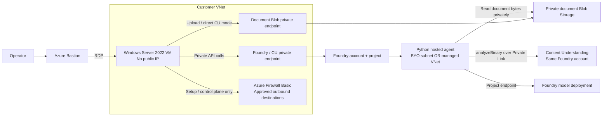

# Private Content Understanding and Foundry demo

A Python / `uv` demo that analyzes private Blob documents using Content
Understanding (CU), either directly from a Windows Server VM or through a genuine
Foundry **hosted agent**. In agent mode, Blob download and CU analysis execute in
Foundry, not in a client-side function-calling loop.

Infrastructure is provisioned with **azd + Bicep**, with separate **BYO VNet** and
**managed VNet** environments. The default region is **South Central US
(`southcentralus`)**, not Central US (`centralus`).

**This repository prepares the solution; it does not imply an Azure deployment
has been completed.** Subscription quota, policies, model/SKU capacity, and live
private connectivity must be checked before deploying. Hosted-agent source
deployment and its hosting adapter are evolving features; the adapter is pinned
by `uv.lock` to a prerelease version. CU uses the GA `2025-11-01` API.

## Network design



The diagram shows logical connectivity. In the managed variant, outbound private
endpoints live in Microsoft's managed network, **not** as NICs in your VNet.
Standard agent state also uses separate private Storage, Cosmos DB, and AI Search
resources. Business documents are not mixed with the agent's backing storage.

| Aspect | BYO VNet | Managed VNet |
|---|---|---|
| Agent compute | Dedicated `/24` subnet delegated to `Microsoft.App/environments` | Microsoft-managed network |
| Egress control | Customer firewall, routes, and NSGs | `AllowOnlyApprovedOutbound`, managed private endpoints and FQDN rules |
| Routing / peering | Customer controls the network | No customer-managed routing or firewall inside the managed network |
| Visibility | Customer network configuration and firewall are inspectable | Managed endpoints have no customer-visible NIC; outbound traffic logging has service limitations |
| Private client access | VM and inbound private endpoints in customer VNet | Still requires VM and inbound private endpoints in customer VNet |
| Changing modes | Create a **different** environment/account | No in-place conversion from BYO or disabling managed isolation |

These are current **Foundry AIServices accounts/projects**, not classic
Azure AI hub workspaces.

### What "private" means here

- Public network access is disabled for Foundry/CU, both Storage accounts, Cosmos
  DB, and AI Search. Do not enable public access as a troubleshooting fallback.
- The Windows VM has no public IP. RDP is permitted only from the Bastion subnet.
- Bastion and the customer firewall deliberately have public IPs for management
  access and controlled egress. This is **not an air-gapped deployment**.
- Entra ID, platform dependencies, software distribution and the approved Python
  feed require outbound connectivity. A private endpoint protects ingress;
  **it does not, by itself, isolate agent egress**.
- CU is not given a private Blob URL or SAS and expected to fetch it. Python reads
  the Blob through its private endpoint, then sends bytes to `analyzeBinary`.
- Authentication uses Entra ID. No Storage account keys, CU API keys, or SAS
  tokens are required.
- Network privacy is different from data residency. The default model SKU is
  `GlobalStandard` and CU requests explicitly use `processingLocation=global`.
  A South Central US resource does not guarantee US-only or region-only model
  processing.

## Prerequisites and cost

Use a subscription where the operator can create resources and assign roles:
typically **Owner**, or the necessary resource permissions plus **Role Based
Access Control Administrator**. ARM Contributor alone does not grant Foundry/CU
data-plane access. Use the same Entra principal for `az login` and `azd auth login`.

The infrastructure grants the operator appropriate project/CU data-plane roles.
The VM identity is for runtime access, not deployment administration. After agent
creation, `deploy-agent` assigns the **agent's distinct `instance_identity`**:

| Identity | Access |
|---|---|
| Windows VM | Document upload/read, CU analysis, agent invocation |
| Hosted agent | Blob Data Reader on the document container; CU Reader on the account |
| Foundry project | Model proxy and standard agent backing resources |
| Signed-in operator | Provisioning, CU defaults, agent versions, and runtime role assignments |

VM agent access uses **Foundry Agent Consumer**, not the broader Foundry User
developer role. The operator's future-agent role delegation is limited to CU
Reader and Blob Reader on the specific account/container.

**Budget for always-on services.** VM/disks, Bastion, the customer firewall, managed
firewall when FQDN rules are used, private endpoints, Search, and Cosmos DB incur
charges independently of document requests. CU/model usage is additional.
Running both environments simultaneously duplicates most resources. Start with
one, record results, then deploy the other if the budget permits.

Install Azure CLI, azd 1.29 or later, and uv 0.9.26 or later on the deployment
workstation. Bicep modules are restored from the public Microsoft registry.
The Python runtime is **3.13** on both Windows and the Linux hosted agent.

The user-approved Python package index is
`https://packagefeedproxy.microsoft.io/pypi/simple/`. It is configured in
`pyproject.toml`, recorded in `uv.lock`, and included in the hosted requirements.
The VM **and the hosted remote builder** must be able to reach it. No feed
credentials are stored in source, configuration exports, or code archives.
To use another approved feed, update the index and regenerate the lock with `uv
lock`; do not disable TLS verification or merely edit a generated requirements
file. The firewall allowlists must match the selected feed.

## 1. Create an azd environment

Run from this repository in PowerShell. These first commands create local azd
configuration, not Azure resources.

```powershell
az login
azd auth login
$subscriptionId = '<your-subscription-id>'
az account set --subscription $subscriptionId

.\scripts\New-DemoEnvironment.ps1 `
    -EnvironmentName cu-byo `
    -NetworkMode byo `
    -SubscriptionId $subscriptionId
```

The script explicitly sets the subscription and `southcentralus` in azd; Azure CLI
and azd defaults can differ. `centralus` is intentionally rejected because it is
not currently listed for both CU and Foundry managed networking.

Before provisioning, review:

- Provider registration and Azure Policy constraints, including permitted
  regions, SKUs, required tags, and role-assignment restrictions.
- VM regional/family vCPU quota (default VM: `Standard_D2s_v5`, two vCPUs), three
  customer public IPs, networking resources, and the service account limits.
- Availability and capacity of `gpt-5.2` version `2025-12-11` and
  `text-embedding-3-large`, the configured model SKUs, and the capacities in
  `infra\main.bicep`. Availability in a region does not imply quota in your
  subscription.
- Hosted-agent and managed-network regional support and current service
  limitations in the references below.

The default model capacity allocations are 30 completion units and 10 embedding
units. These are model/SKU-specific quota units, not prepaid usage. CU's internal
prompts need headroom; an allocation of one unit can be too small even for a
short invoice. See [the infrastructure settings](infra/README.md) for overrides.

Useful read-only commands:

```powershell
# Install the quota extension first if it is not already available.
az quota list --scope "/subscriptions/$subscriptionId/providers/Microsoft.Compute/locations/southcentralus"
az quota usage list --scope "/subscriptions/$subscriptionId/providers/Microsoft.Compute/locations/southcentralus"
az network list-usages --location southcentralus --subscription $subscriptionId
az cognitiveservices model list --location southcentralus --subscription $subscriptionId `
    --query "[?model.name=='gpt-5.2' || model.name=='text-embedding-3-large']"
az cognitiveservices usage list --location southcentralus --subscription $subscriptionId
az policy assignment list --scope "/subscriptions/$subscriptionId" --disable-scope-strict-match
```

Where a provider does not expose a quota API, review its documented limits and
the actual resources already deployed. No quota increase or provider registration
is performed automatically by these scripts.

## 2. Provision infrastructure

Only proceed after reviewing capacity, permissions, and cost.

```powershell
.\scripts\Provision-Demo.ps1 -EnvironmentName cu-byo -QuotaReviewed
.\scripts\Export-ClientConfig.ps1 -EnvironmentName cu-byo
```

`Provision-Demo.ps1` invokes **`azd provision`**. It asks for a strong Windows
administrator password (user name defaults to `demoadmin`), passes it through a
process-scoped environment variable into a secure Bicep parameter, then removes
or restores that process variable. **Do not use `azd env set` to store the
password.** The password must also meet Azure/organizational complexity rules.

`Export-ClientConfig.ps1` produces `.azure\cu-byo\client.json` using an explicit
allowlist of non-secret values. It does not export passwords or all azd variables.
Use `-Force` only when intentionally replacing an earlier client configuration.

This is intentionally a **two-stage workflow**:

1. ARM infrastructure provisioning can run on the external workstation.
2. CU configuration, agent code deployment and document operations run inside the
   private network, from the Windows VM.

There is no public web-app deployment or private data-plane hook on the external
workstation. Use `azd provision`, not `azd deploy`, for this infrastructure-only
`azure.yaml`.

## 3. Prepare the Windows VM

Connect using Azure Bastion. The Azure portal Bastion connection is sufficient
for interactive RDP; native-client RDP with drive redirection is useful for
copying the current worktree. There is no direct Internet RDP rule.

Copy the current repository and the exported client JSON to the VM. Do not assume
a GitHub clone contains local, uncommitted changes. A source bundle can be made
on the workstation without including `.git`, `.azure`, credentials, or local data:

```powershell
Compress-Archive -Path @(
    'azure.yaml', 'infra', 'scripts', 'src', 'hosted', 'tests', 'samples',
    'pyproject.toml', 'uv.lock', 'README.md'
) -DestinationPath '.azure\worktree-source.zip'
```

Transfer that ZIP and `.azure\cu-byo\client.json` through your approved Bastion/RDP
file-transfer mechanism. Extract the ZIP into a folder such as
`C:\Demos\private-cu`; place the JSON there as `client.json`.

From an **administrator** PowerShell window on the VM:

```powershell
Set-Location C:\Demos\private-cu
.\scripts\Install-Tools.ps1
```

The script downloads official Azure CLI, azd, and uv distributions. It verifies
the Microsoft MSI signatures and the pinned azd/uv SHA-256 values. It installs
Python 3.13 using uv, keeps installers for inspection, and never weakens
certificate validation. Follow your organization's script-execution policy.
Existing corporate software distribution can be used instead.

Open a new terminal, then:

```powershell
Set-Location C:\Demos\private-cu
uv sync --frozen --native-tls
uv run --frozen private-cu --config .\client.json diagnose

# Operator authentication is for CU setup and agent deployment only.
az login --use-device-code
uv run --frozen private-cu --config .\client.json configure-cu
```

`diagnose` fails if any endpoint resolves publicly or TCP 443 is unreachable.
It checks the current machine, not the hidden managed network. Runtime requests
also reject public, loopback, or link-local endpoint resolution.

## 4. Run direct CU and hosted-agent analysis

The included invoice is fictional.

```powershell
# Runtime calls default to the VM's system-assigned managed identity.
uv run --frozen private-cu --config .\client.json upload .\samples\invoice.txt
uv run --frozen private-cu --config .\client.json analyze invoice.txt `
    --output .\outputs\direct-invoice.json

# This uploads only whitelisted Python source and locked requirements.
# It creates a real hosted agent, waits for its version, grants its own identity
# Blob/CU permissions, and selects that version on the private agent endpoint.
uv run --frozen private-cu --config .\client.json deploy-agent

# Newly assigned roles can take several minutes to propagate.
uv run --frozen private-cu --config .\client.json agent invoice.txt `
    --question 'Extract the invoice number, amount due, due date, and any uncertainties.' `
    --output .\outputs\agent-invoice.json
```

Runtime commands support `--credential cli` for an explicitly signed-in
developer. They do not silently fall back from VM identity to user credentials.
`configure-cu` and `deploy-agent` deliberately use the signed-in Azure CLI
operator, scoped to the subscription in the exported ARM IDs.

Direct output includes the Blob ETag/hash, structured CU fields, confidence
metadata, and the private IPs resolved by the process. The hosted tool produces
equivalent evidence with `execution.location=foundry-hosted`, which the agent
uses in its answer. Compare this with `windows-client` in direct output.
The configured mode label alone is not a packet-level network attestation.

Upload and local output files are **not overwritten by default**. Use
`upload --overwrite` only intentionally; choose a new local output filename on
subsequent runs.

To inspect the source package without Azure access:

```powershell
uv run --frozen private-cu package-agent --output .azure\agent-code.zip
```

The ZIP has `main.py`, the runtime package and `requirements.txt` at its root. It
excludes operator deployment code, environment files, documents, and Windows
virtual environments. No Linux container image is built on Windows.

## 5. Compare the managed variant

Create a **new** environment; never change an existing account's injection mode.

```powershell
.\scripts\New-DemoEnvironment.ps1 `
    -EnvironmentName cu-managed `
    -NetworkMode managed `
    -SubscriptionId $subscriptionId

# Recheck capacity and cost before creating the second environment.
.\scripts\Provision-Demo.ps1 -EnvironmentName cu-managed -QuotaReviewed
.\scripts\Export-ClientConfig.ps1 -EnvironmentName cu-managed
```

Repeat the VM/setup/analysis steps with that environment's VM and client JSON.
Do not mix endpoints or ARM IDs from the two environments. For managed networking,
check that all outbound private endpoints, **including the self-connection to
Foundry/CU and the document Storage account**, are approved before deploying the
hosted code. Built-in agent state connections alone are not sufficient.

## Limits and troubleshooting

| Symptom | Action |
|---|---|
| Azure CLI token cache/authentication error | Run `az login` for the correct tenant/subscription; authenticate azd separately |
| Public DNS address | Check private DNS links/zone groups and which network runs the command; never enable public service access |
| HTTP 403 | Check the **actual caller's** data-plane role and propagation, not just ARM Contributor or the project's identity |
| Hosted version fails during provisioning | Inspect the version's error using the SDK; check source dependencies, approved egress, runtime and private DNS |
| Managed agent cannot reach CU/Blob | Check self and document outbound private endpoints, approvals, and agent-specific RBAC |
| Package restore fails | Check the approved index and its outbound route; no certificate-verification bypass |
| Failed or timed-out CU operation | An accepted operation may still run and be billed; analysis POSTs are not automatically repeated |
| Model not advertised by analyzer | Inspect `supportedModels`; update model deployments/configuration deliberately and rerun `configure-cu` |

The demo accepts PDF, TXT, DOCX and common document images. Its default upload
limit is **20 MiB** (configurable up to the CU document limit through
`MAX_DOCUMENT_BYTES`); polling defaults to 600 seconds. Agent evidence larger than
60,000 characters is rejected rather than silently truncated. Use direct analysis
or a smaller document in that case. The hosted tool loop permits at most one
analysis call per request to bound repeated CU charges. CU/model service limits
still apply.

This is a trusted-user demo, not a multi-tenant application. Agent consumers can
ask about documents in the configured container. Document content is treated as
untrusted model input, but prompt instructions are not a substitute for
per-document authorization. No public web/search tools, arbitrary URL fetching,
or automatic financial/legal decisions are included.

## Local development

```powershell
uv sync --frozen --native-tls
uv run --frozen python -m unittest discover -s tests -v
powershell.exe -NoProfile -File .\tests\test_scripts.ps1
az bicep build --file .\infra\main.bicep --outfile .\.azure\compiled-main.json
```

The Python suite uses real installed SDK models/tool wrappers with mocked cloud
transport. It does not create resources or require Azure tokens. Compilation and
offline tests do not establish live Azure service support or subscription capacity.

## Cleanup

Save any documents/results you need before deleting an environment. Stop using
the hosted agent and remove its versions/resources first, then the project and
account capability hosts. Follow the current Foundry cleanup order in the
official networking samples. Soft-deleted Foundry resources can retain network
dependencies until purged; removing the VNet first can leave a failed teardown.

After reviewing the **exact selected resource group** and approving deletion,
use `azd down` for that environment. Do not use `--force`/automatic purge as a
default. Never delete shared or pre-existing resources to resolve a dependency.
Check that Bastion, firewalls, disks, private endpoints and supporting services
are gone; deallocating only the VM does not stop their charges.

## References

- [Foundry networking options](https://learn.microsoft.com/azure/foundry/agents/concepts/networking-options)
- [BYO VNet setup and limitations](https://learn.microsoft.com/azure/foundry/agents/how-to/virtual-networks)
- [Managed VNet setup, costs and limitations](https://learn.microsoft.com/azure/foundry/how-to/managed-virtual-network)
- [Official BYO Bicep sample](https://github.com/microsoft-foundry/foundry-samples/tree/main/infrastructure/infrastructure-setup-bicep/15-private-network-standard-agent-setup)
- [Official managed Bicep sample](https://github.com/microsoft-foundry/foundry-samples/tree/main/infrastructure/infrastructure-setup-bicep/18-managed-virtual-network)
- [CU private networking](https://learn.microsoft.com/azure/ai-services/content-understanding/concepts/secure-communications)
- [CU Analyze Binary API](https://learn.microsoft.com/rest/api/contentunderstanding/content-analyzers/analyze-binary?view=rest-contentunderstanding-2025-11-01)
- [CU regions and model defaults](https://learn.microsoft.com/azure/ai-services/content-understanding/language-region-support)
- [Hosted source-code deployment](https://learn.microsoft.com/azure/foundry/agents/how-to/deploy-hosted-agent-code)
- [Hosted identity and permissions](https://learn.microsoft.com/azure/foundry/agents/concepts/hosted-agent-permissions)
- [Azure Verified Modules](https://azure.github.io/Azure-Verified-Modules/)